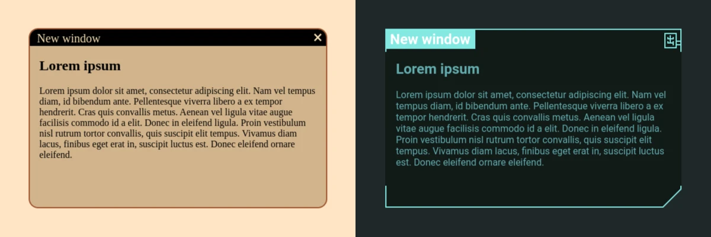

# PWin - Page Windows

Прочитать на другом языке: [English](./README.md).

PWin позволяет создавать HTML-контейнеры схожие видом и функционалом с тем, как работают окна приложений на любом обычном компьютере.

Примеры:
* [Pathos](https://leshiy-nd.github.io/PWin-Page-Windows/examples/pathos.html)
* [Tan](https://leshiy-nd.github.io/PWin-Page-Windows/examples/tan.html)

## Структура окна

|Класс CSS |Пояснение|
|-|-|
|pwin_root|Контейнер для всех PWin-окон. Невидимо растянут на весь экран, не препядствуя интеракциям с прочими элементами страницы.|
|pwin_win|Контейнер для каждого отдельного PWin-окна.|
|pwin_hand|Наведя курсор на этот элемент и зажав левую кнопку мыши, пользователь сможет переместить соответствующее PWin-окно куда ему заблагорассудится.|
|pwin_hand_g|Зажатый __pwin_hand__. 100-кратно увеличивается в размерах, чтобы минимизировать потерю курсора. Так что лучше внутрь ничего не ложить.|
|pwin_close|Кнопка для закрытия соответствующего PWin-окна.|
|pwin_body|Содержит непосредственный html-контент PWin-окна.|

## Использование

1. Скопируйте [__pwin.js__](./pwin.js) и [__pwin.css__](./pwin.css) в директорию своего сайтa куда будет удобно.
2. Включите их в заголовок страницы, на которой планируете их использовать.
3. Создайте пустой DIV-элемент класса __"pwin_root"__ в теле страницы.
4. Создайте свой JS-скрипт для генерации PWin-окна (или возьмите из примера).
5. Пропишите соответствующие CSS-стили (или возьмите из примера).
6. Чтобы свеже-созданные окна стали интерактивны, вызовите функцию __register_new_windows()__ из __pwin.js__.
7. Упомяните меня где-нибудь как-нибудь, если вам не сложно :)

## Свой скрипт генерации PWin-окна

Обязательно:
* К моменту запуска этого скрипта уже должен существовать __"pwin_root"__, найдите его.
* Создайте пустой DIV-элемент класса __"pwin_win"__ и прикрепите его к __"pwin_root"__.
* Добавьте элементу __"pwin_win"__ аттрибут __"pwin_new"__.

Опционально:
* Создайте пустой DIV-элемент класса __"pwin_hand"__ и прикрепите его к __"pwin_win"__.
* Создайте пустой DIV-элемент класса __"pwin_close"__ и прикрепите его к __"pwin_win"__.
* Создайте DIV-элемент класса __"pwin_body"__ и прикрепите его к __"pwin_win"__.
* Поместите всё, что сочтёте нужным в innerHTML элемента  __"pwin_body"__.

Не важно, как глубоко или причудливо расположены элементы __hand__, __close__ и прочие. Пока, они находятся в семейном дереве элемента __win__, они будут подобраны скриптом __register_new_windows()__.

## Свой CSS стайлинг PWin-окна

Вы свободны делать всё, что вам вздумается.

Единственное, от чего бы я вас предостерёг, это от назначения _"overflow: hidden;"_ к __"pwin_win"__, так как это обрежет __"pwin_hand_g"__. Что в свою очередь может привести к лёгкой потери курсора, как это можно увидеть в примере [Pathos](https://leshiy-nd.github.io/PWin-Page-Windows/examples/pathos.html), в котором я использовал скрытие вытекающих элементов для справления с рамкой и "подрезанным" углом. Просто создайте дополнительный DIV для всего обрезаемого.
